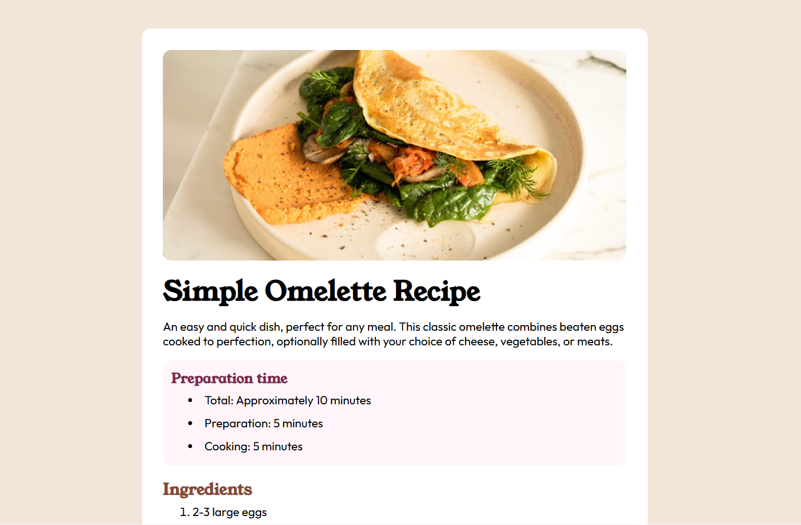

# Frontend Mentor - Recipe page solution

## Table of contents

- [Overview](#overview)
  - [The challenge](#the-challenge)
  - [Screenshot](#screenshot)
  - [Links](#links)
- [My process](#my-process)
  - [Built with](#built-with)
  - [What I learned](#what-i-learned)
  - [Continued development](#continued-development)
  - [Useful resources](#useful-resources)
- [Author](#author)


## Overview

### Screenshot



### Links

- Solution URL: [Add solution URL here](https://your-solution-url.com)
- Live Site URL: [Add live site URL here](https://your-live-site-url.com)

## My process

### Built with

- Semantic HTML5 markup
- CSS custom properties
- Flexbox


### What I learned

I learned how to use media queries to tailor my work to different screen sizes:


```css
@media screen and (min-width: 480px) and (max-width: 1250px){
    body{
        padding: 35px;
    }

    img{
        width: 100%;
    }

    p, li{
        font-size: 20px;
    }

    h3{
        font-size: 25px;
    }

    h4{
        font-size: 20px;
    }

    tr td{
        font-size: 20px;  
    }

}

/* Mobile Screen */
@media screen and (max-width: 480px){
    body{
        padding: 35px;
    }

    img{
        width: 100%;
    }

    p, li{
        font-size: 20px;
    }

    h3{
        font-size: 25px;
    }

    h4{
        font-size: 20px;
    }

    tr td{
        font-size: 20px;  
    }

}
```


### Continued development
Responsiveness


### Useful resources

- [Example resource 1](https://www.w3schools.com/css/css3_mediaqueries.asp) - This helped me to understand media queries and they work


## Author

- Website - [DAVID OBENG ADJEI](https://www.your-site.com)
- Frontend Mentor - [@yourusername](https://www.frontendmentor.io/profile/yourusername)

